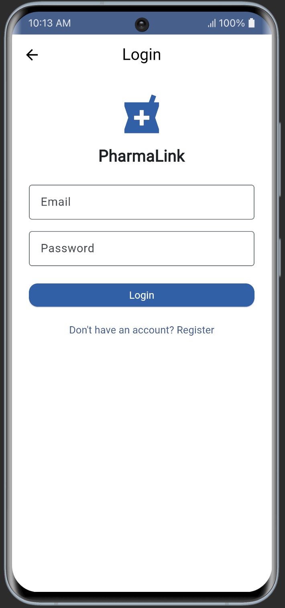
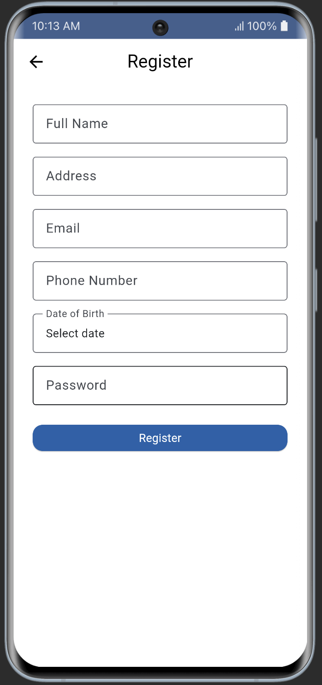
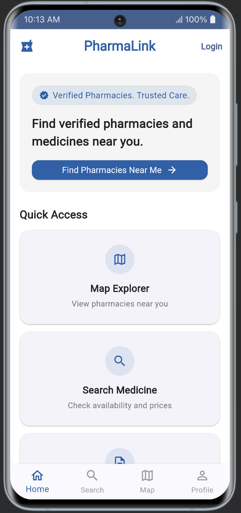
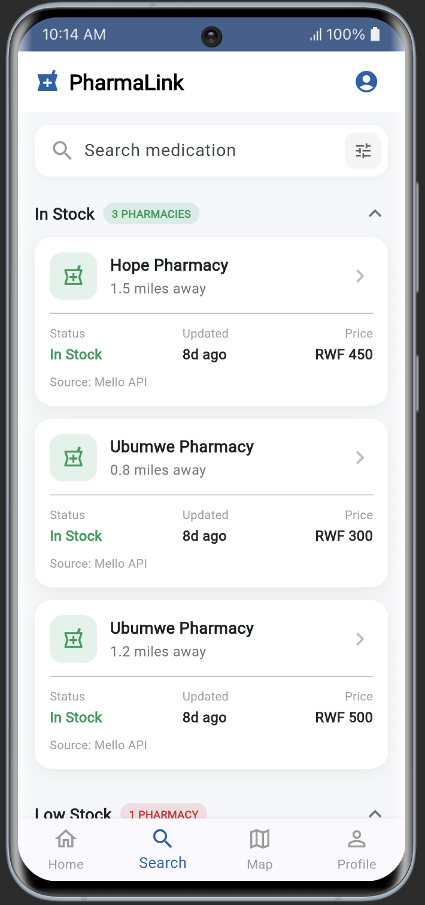
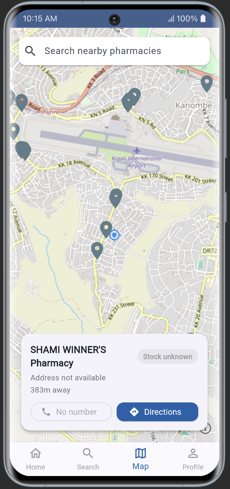
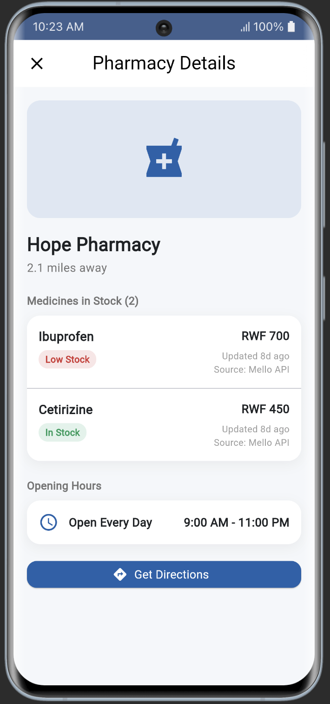
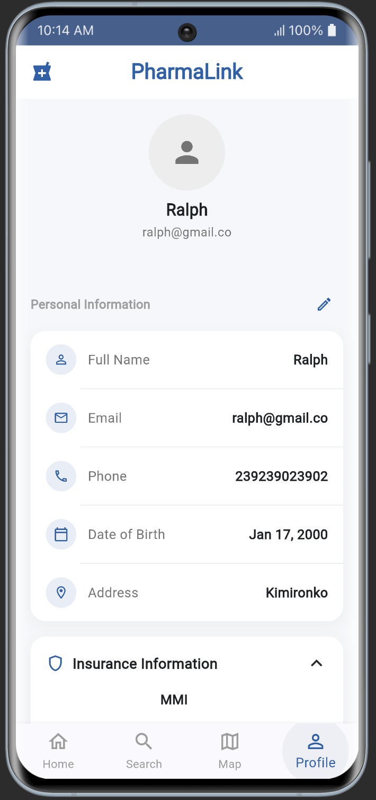

# PharmaLink — Getting started

## 1. Clone and install

```bash
git clone <repo-url>
cd pharmalink
flutter pub get
```

## 2. Run it — no API keys needed

Firebase config (`google-services.json`, `GoogleService-Info.plist`, `firebase_options.dart`) is already committed to the repo, so it works out of the box — no `flutterfire configure` needed. The map uses free OpenStreetMap tiles (`flutter_map`), not Google Maps, so there's no map API key to request either.

```bash
flutter run -d chrome          # fastest for quick checks
# or
open -a Simulator && flutter run
# or an Android emulator/device: flutter devices, then flutter run -d <id>
```

Grant location permission when prompted : the Map tab needs it. To log in, register a new account from the app's Register screen; there's no shared test account unless someone posts one in the group chat.

## 3. Project structure

```
lib/
├── main.dart / app.dart          # app entry point — don't touch unless we agree on it together
├── core/                         # shared stuff: theme, constants, shared services/widgets
├── navigation/root_shell.dart    # bottom nav — owns the 4 tabs below
└── features/
    ├── ralph_auth/               ← Ralph        (login / register)
    ├── ralph_home/               ← Ralph        (bottom nav: Home)
    ├── faith_search_detail/      ← Faith        (bottom nav: Search)
    ├── louis_map/                ← Louis        (bottom nav: Map)
    ├── racheal_profile/          ← Racheal      (bottom nav: Profile)
    └── blessing_pharmacy_detail/ ← Blessing     (NOT a tab — a detail screen
                                                    pushed from Home/Search/Map
                                                    when a pharmacy is tapped)
```

**Rule of thumb:** work inside your own `features/<yourname_feature>/` folder (`cubit/`, `models/`, `screens/`, `widgets/`). Only touch `core/` or `navigation/` if it's something genuinely shared — flag it in the group chat first so we don't step on each other.

**Blessing specifically:** your screen gets reached via `Navigator.push()`, not a bottom nav tab — coordinate with Ralph, Faith, and Louis on how they'll navigate to your screen (e.g. passing a `Pharmacy` object or an id).

## 4. Branching workflow

```bash
git checkout main
git pull
git checkout -b feature/<your-feature-name>   # e.g. feature/search
```

Work inside your feature folder, commit as you go, push your branch, open a PR into `main` when it's ready. Don't push directly to `main`.

```bash
git push -u origin feature/<your-feature-name>
```

## 5. Wiring your screen into the app

`root_shell.dart` currently shows a placeholder for each tab (Home, Search, Map, Profile). Once your screen exists, replace your placeholder with your real widget (import it at the top, swap it into the `_tabs` list) as part of your PR — don't edit anyone else's tab.

Blessing: no placeholder to swap — just make sure your screen accepts whatever the calling screen passes in (e.g. a `Pharmacy` object).

## 6. Before you push

```bash
flutter analyze     # no warnings
flutter run          # confirm it actually builds and the bottom nav still works
```

Testing email:
student@gmail.com
student12

## 7. Screenshots

Drop each image into `docs/screenshots/` using the filename already referenced below — the markdown will just pick it up. Until then these show as broken image links, that's expected.

### Auth — Ralph


*Login screen — email/password fields, "Register" link. Also grab one showing the "Wrong password or email" error state.*


*Register screen — full form (name, address, email, phone, DOB, password), ideally with an empty-field validation error visible.*

### Home — Ralph


*Home tab, logged-in state.*

### Search — Faith


*Search tab with a query typed in and results split into "In Stock" / "Low Stock" sections.*

### Map — Louis


*Map tab with pharmacy pins visible, one pin tapped so the detail card is showing at the bottom.*

### Pharmacy Detail — Blessing


*Pharmacy detail screen (reached by tapping a pin or a search result) — medicine stock list and the "Get Directions" button.*

### Profile — Racheal


*Profile tab — personal info, insurance section, the "Notify me about low stock" toggle, and the Log Out / Delete My Data buttons at the bottom.*
